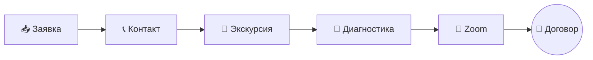

# Талантвилль — Бизнес-процессы

> Скрипт продаж и протокол фиксации отказов  
> Версия от 25.06.2026

## Общая воронка

## Документация

| Этап | Описание | Ответственный |
|------|----------|---------------|
| [1](stages/01-zayavka.md) | Заявка → первый контакт | Наталья |
| [2](stages/02-ekskursiya.md) | Приглашение на экскурсию | Наталья |
| [3](stages/03-followup.md) | Follow-up после экскурсии | Наталья |
| [4](stages/04-diagnostika.md) | Диагностика и явка | Анастасия |
| [5](stages/05-dogovor.md) | Zoom → решение → договор | Наталья + комиссия |

## CRM-правила

См. [протокол фиксации отказов](crm/protokol-otkazov.md)
