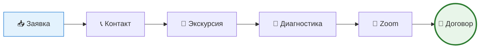

# Талантвилль — Скрипт продаж и протокол фиксации отказов

> Версия от 25.06.2026  
> Состоит из двух частей: единый скрипт по всем этапам от заявки до договора и обязательный протокол фиксации причины на каждом шаге.

## 🎯 Общая воронка продаж

## 📚 Этапы процесса

| № | Этап | Цель | Ответственный |
|---|------|------|---------------|
| 1 | [Заявка → первый контакт](stages/01-zayavka.md) | Квалифицировать интерес, снять барьер по стоимости | Наталья |
| 2 | [Приглашение на экскурсию](stages/02-ekskursiya.md) | Не дать лиду «охладеть» (здесь теряется 60%) | Наталья |
| 3 | [Follow-up после экскурсии](stages/03-followup.md) | **Критическая зона** (−72%) — минимум 3 касания | Наталья |
| 4 | [Диагностика и явка](stages/04-diagnostika.md) | Запись, напоминание, контроль явки | Анастасия |
| 5 | [Zoom → решение → договор](stages/05-dogovor.md) | Три типа лидов — три сценария работы | Наталья + комиссия |

## 📋 CRM-правила

- [Протокол обязательной фиксации причины](crm/protokol.md)
- [Справочник причин по этапам](crm/spravochnik.md)

## ⚡ Главное правило

> **Если причина не зафиксирована — лид не закрыт. Точка.**

## 💡 Рекомендация по автоматизации

Уточнить у ответственного за СКМ (МегаПлан), можно ли сделать поле «Причина» **обязательным** при смене статуса на «отказ» или «нет ответа» — это закрывает зону системно, а не на доверии.