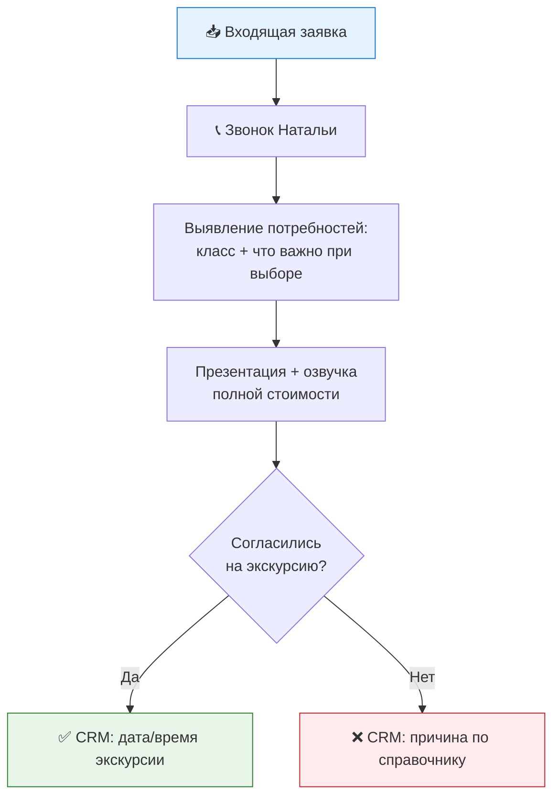

# Этап 1. Заявка → первый контакт

**Ответственный:** Наталья  
**Цель:** Квалифицировать интерес, сразу снять барьер по стоимости, договориться о конкретном следующем шаге — не «я подумаю», а дата и время.

## 🔄 Схема процесса

## 💬 Скрипт

### Приветствие и выявление потребностей

> Добрый день, [Имя]! Меня зовут Наталья, я директор по приёму школы Талантвилль. Вы оставили заявку — расскажите, пожалуйста, в какой класс ребёнок и что для вас сейчас важнее всего при выборе школы?

*[слушать, фиксировать ответ — это пригодится на экскурсии и диагностике]*

### Презентация и приглашение

> Спасибо! Предлагаю два шага: сначала я пришлю короткую презентацию — ценности, программа, как устроен день. А дальше приглашаю на очную экскурсию, чтобы вы увидели всё сами и задали вопросы вживую. Когда вам удобно — на этой неделе или на следующей?

### Озвучка стоимости (сразу!)

> И сразу скажу про стоимость: обучение стоит [X], отдельно оплачивается продлёнка и питание — это [Y] в месяц. Если ребёнок переходит из нашего садика в школу — стоимость школы отличается от сада, скажу сразу, на сколько.

## 🛡️ Работа с возражениями

### «Почему так дорого?»
Не оправдываться ценой — объяснить, за что именно платят:
- малые классы (6–15 человек)
- психолог в составе диагностики
- индивидуальный трек

Сравнение с конкурентом — **только если родитель сам называет конкретную школу**.

### «У вас своя лицензия?»
Отвечать честно и сразу: лицензия — у партнёра Олимп-Плюс, это легальная и распространённая практика для частных школ такого формата. **Не уходить от вопроса** — именно недосказанность здесь стоит доверия.

### «Мы пока смотрим другие школы»
Не давить. Зафиксировать:
- какие ещё школы рассматривают
- когда планируют решить
- договориться о дате следующего касания — не «я вам сама напишу»

## 📊 Фиксация в CRM

1. ✅ Договорились об экскурсии — дата/время внесены в календарь **немедленно**
2. ❌ Отказ или нет ответа — заполнить поле «Причина» по [справочнику](../crm/spravochnik.md#этап-1-заявка--первый-контакт) не позднее **24 часов**

## 🔗 Навигация

← [Назад к общей воронке](../README.md) | Далее: [Этап 2. Приглашение на экскурсию →](02-ekskursiya.md)